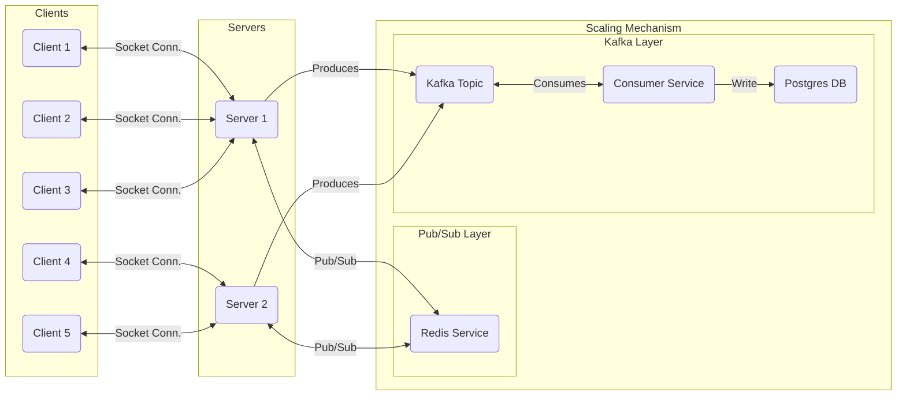
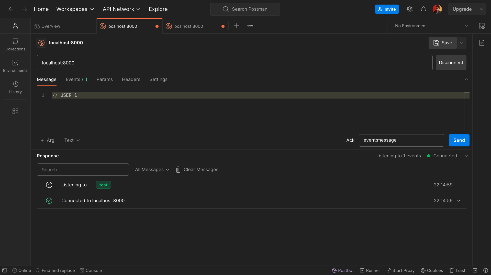
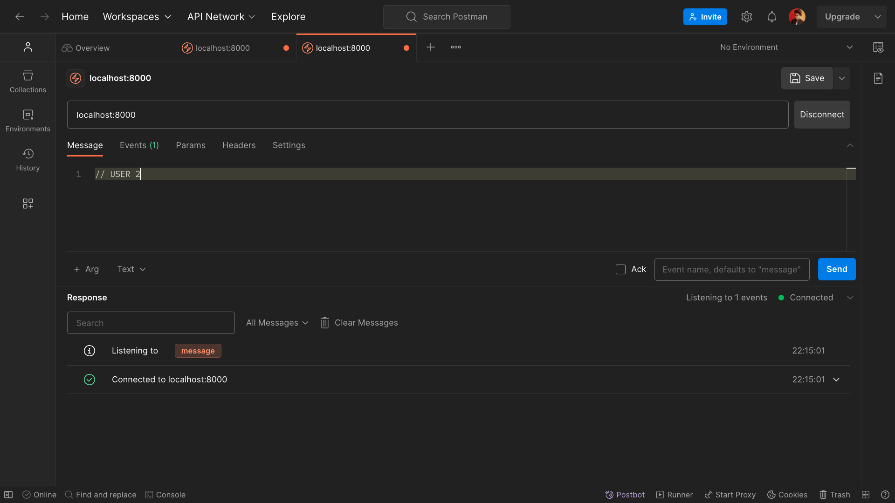
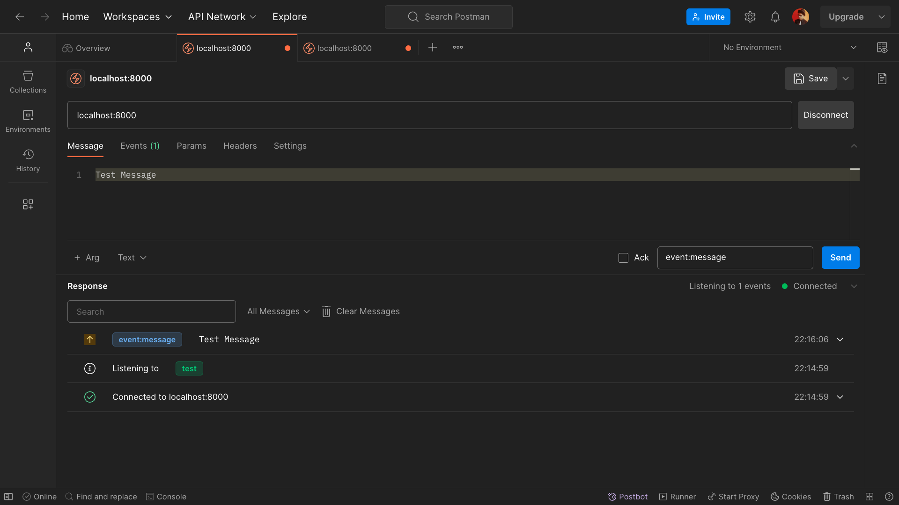
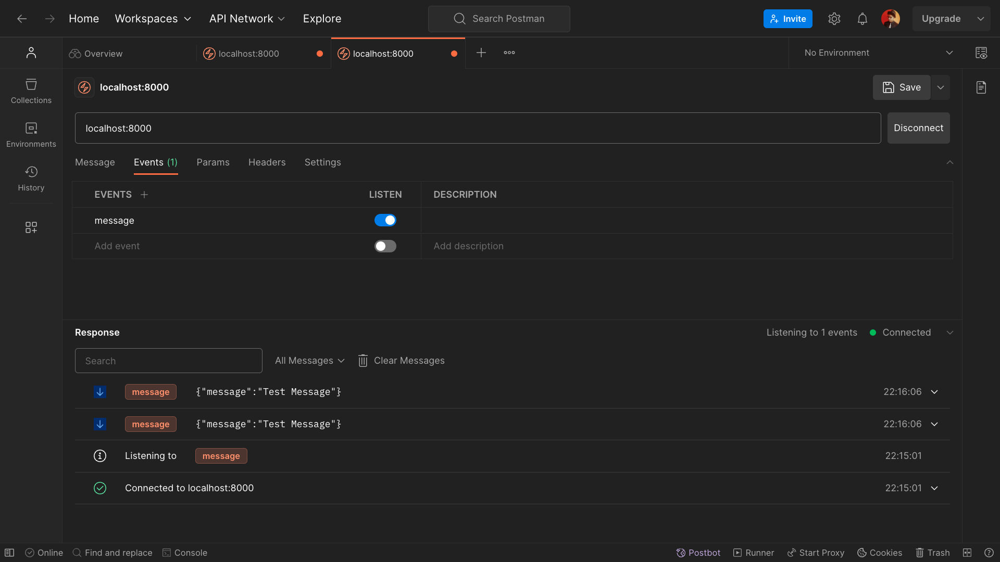
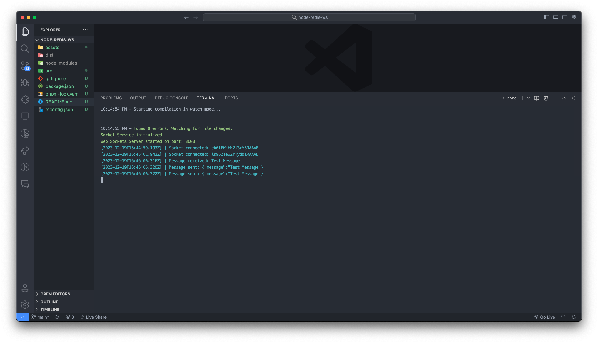

# Scalable Web Sockets | Redis + Kafka + Postgres

> This is a simple example of sclaing Web Sockets using Redis Pub/Sub, Kafka and Postgres.

### Architecture



---

### Tech Stack

- [x] Node.js (Server)
- [x] Redis (Sync messages between multiple servers)
- [x] Kafka (Gather messages with a high throughput and allow consumption)
- [x] Drizzle (ORM for Postgres)

---

### How to run

> This project requires Node.js, Redis, Kafka and Postgres to run.

#### Part 1: Redis & Kafka

> You can use Docker to run Redis and Kafka, or use a local / cloud service.

```bash
docker compose up -d
```

Don't forget to add the following environment variables in the `.env` file:

```bash
REDIS_URL=
KAFKA_BROKER_URL=
```

#### Part 2: Postgres

> You can either use the Docker Compose Postgres container, or spin it up locally, or a third-party service.
> I've used Vercel's Postgres service.

Make sure to add the following environment variables in the `.env` file:

```bash
POSTGRES_URL=
POSTGRES_PRISMA_URL=
POSTGRES_URL_NON_POOLING=
POSTGRES_USER=
POSTGRES_HOST=
POSTGRES_PASSWORD=
POSTGRES_DATABASE=
```

#### Part 3: Server

```bash
# Clone the repository
git clone https://github.com/McTechie/scalable-websockets.git

# Change directory
cd scalable-websockets

# Install pnpm (Skip if already installed)
npm i -g pnpm

# Install dependencies
pnpm install

# Run the server
pnpm dev
```

---

### Demo

#### Client 1



#### Client 2



#### Message Broadcast [Client 1]



#### Message Received [Client 2]



#### Server Logs


